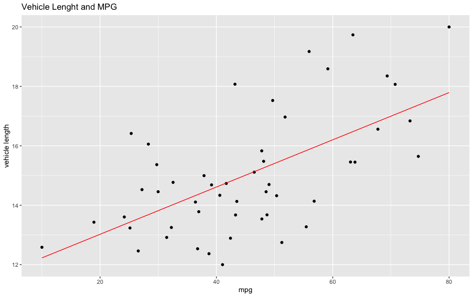
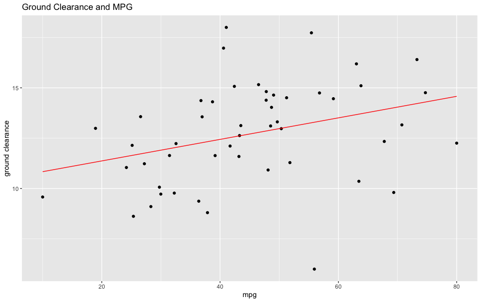

# MechaCar Challenge

## MPG Regression

We performed a multiple linear regression on the MechaCar prototype mpg dataset to answer the following questions: 

* Which variables/coefficients provided a non-random amount of variance to the mpg values in the dataset?
* Does this linear model predict mpg of MechaCar prototypes effectively? Why or why not?
* Is the slope of the linear model considered to be zero? Why or why not?

The summary output for the regression shows that vehicle length and ground clearance coefficients are statistically unlikely to provide random amounts of variance to the linear model. The summary also shows that intercept is significant, indicating other variables and factors contribute to the variation of mpg not accounted for in the model. 

The multiple linear regression model produced an r-squared value of 0.7149. We can assume from this result that 71% of mpg predictions from this model will be correct. 
The p-value of 5.35e-11 is much smaller than our assumed significance level 0f 0.05%. Therefore, we can state that there is sufficient evidence to reject our null hypothesis, which means that the slope of our linear model is not zero.

 
## Suspension Coil Summary

* Summary Statistics Table of PSI data by Lot

| Sample | Mean | Median | SD    | VAR    |
|--------|------|--------|-------|--------|
| Lots   | 1499 | 1500   | 7.89  | 62.29  |
| Lot 1  | 1500 | 1500   | .99   | .98    |
| Lot 2  | 1500 | 1500   | 2.73  | 7.47   |
| Lot 3  | 1496 | 1498   | 13.05 | 170.29 |

Lots 1 and 2 meet design specification of less than 100 pounds per inch for the MechaCar suspension coil. Lot 3 does not meet design specification with a variance of 170.29. This variance is extreme in comparison to lots 1 and 2. 

## Suspension Coil T-Test

| Sample | P-Value | Findings                |
|--------|---------|-------------------------|
| Lots   | .0603   | Statistically Similar   |
| Lot 1  | 1       | Statistically Similar   |
| Lot 2  | .6072   | Statistically Similar   |
| Lot 3  | .0417   | Statistically Different |

Further analysis of the lots via a one sample t-Test shows the p-value of 0.06 for the combined lots is higher than the assumed significance level of 0.05. Lot’s 1 and 2 also produced significant p-scores of 1 and .6072 respectively. Lot 3 produced a p-score of .0417 which falls below the significance level. We do not have sufficient evidence to reject the null hypothesis for the combined lots and lots 1 and 2, and we would state that the means are statistically similar. We have sufficient evidence for lot 3 to fail to reject the null hypothesis and state that the means are statistically different. 

## Design Your Own Study

In these times of economic uncertainty, consumers will prioritize fuel efficiency in relation to price. We recommend the company collect MPG information and price of vehicle class competitors. This data is readily available from www.fueleconomy.gov and other reputable sources. 

The team can perform a two-sample t-test to compare the mean MPG of the competitors to the MechaCar results. The null hypothesis of this study states the mean MPG of the MechaCar is not different from competitors at the same price point. The alternative hypothesis states the mean mpg of the MechaCar is different than competitors at the same price point. 

If the null hypothesis is true, we can assume the MechaCar’s performance and price is in line with the market. If the alternative hypothesis is true further analysis is required to determine the correct price point for the MechaCar.
